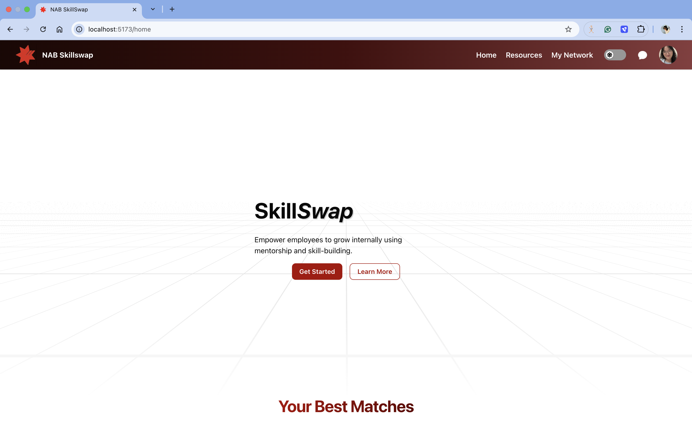
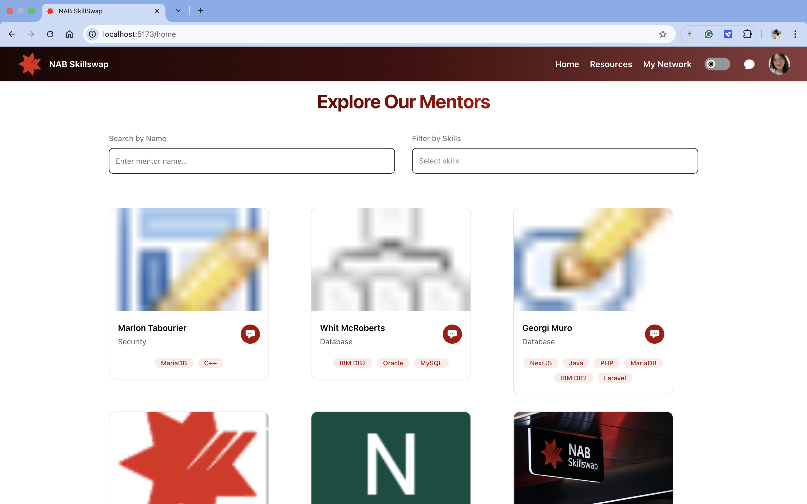
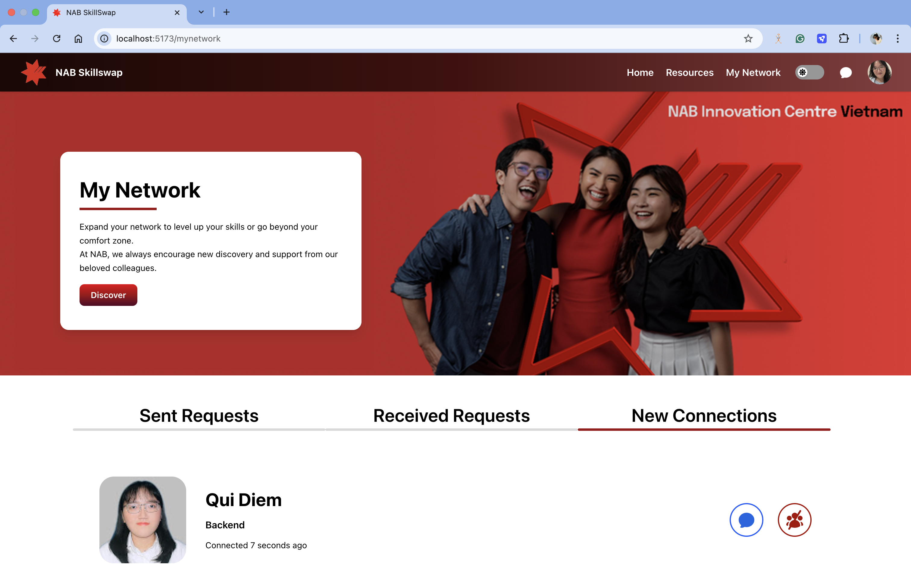
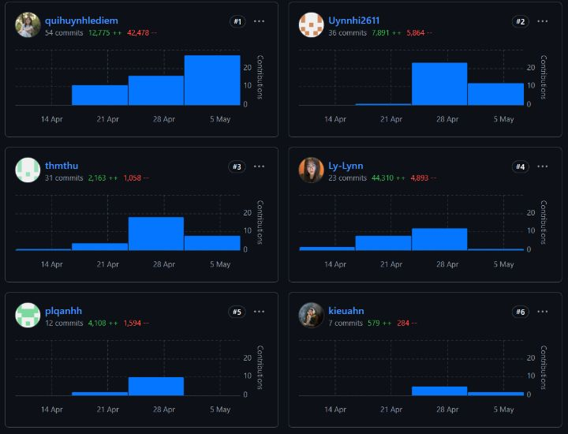
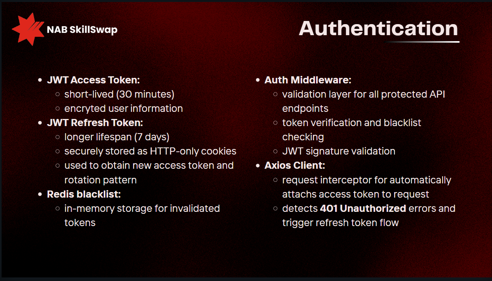
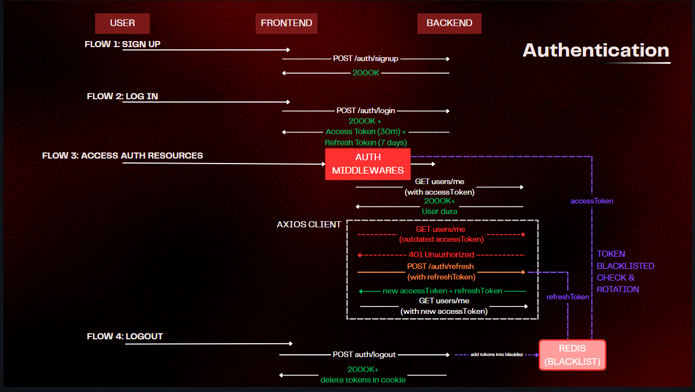

<header id="#header">
<p align="center" >
  <a name="header"></a>
  
</p>

<p  align="center" >
  A web application for skill sharing and learning for NAB community.
</p>

<h1  align="center" >
  WeCamp Batch 7 - WeNAB Team
</h1>
<p align="justify">
NAB SkillSwap is a web application built with the MERN stack (MongoDB, Express, React, Node.js) as part of the WeCamp Batch 7 Capstone project. It lets users create accounts, manage profiles, chat and connect with friends for skills sharing and learning. With features like user authentication, searching, filtering users based on name and skills, and connecting request, real-time chat, NAB SkillSwap offers a smooth and modern user experience.
</p>

<p align="center" >
  
  
</p>
<p align="center" >
  
  
</p>
</header>

# 🌟 Personal Contribution (Lynn)

<p align="center">
  
</p>

## Backend

### Key Contributions:
- ✅ Developed over 80% of the project backend core
- 🔐 Built authentication system with JWT and token rotation using Redis

<p align="center">

  
</p>

- 🔄 Implemented OAuth2 for Google Authentication
- 💾 Designed database/models and configured MongoDB Atlas
- ⚡ Configured Redis (used for blacklisting tokens)
- 🐳 Managed Docker and Docker compose
- 🚀 Deployed containerized application on GCP (Google Cloud Platform) CloudRun

#### Deploy Demo link: [SkillSwap Application](https://skillswap-117849673427.asia-southeast1.run.app/home)

## Frontend
- 🔧 Configured Nginx
- 🎨 Created user-friendly interface for login, signup and logout features
- 🎨 Created user-friendly interface for getting user information about their preferences
- Applying debounce for searching & filtering (as mentioned in <a href="#realtime-search-issue">Search function documentation</a>)

https://github.com/user-attachments/assets/759b6ba1-d090-4e87-bcfe-8540506ce8b4

# 🚩 Table of contents

- [Installation](#installation)
- [Features](#features)
- [Search Function Documentation](#search)
- [Technologies](#technologies)

<a name="installation"></a>

# 🔧 Installation

To install this project, simply clone the git repository and run it

1. Clone the repository

```bash
$ git clone https://github.com/thmthu/skill-swap
```

2. Navigate to the project's **frontend** and **backend** and install required packages using your package manager of choice (ex. npm, yarn, pnpm & bun)

```bash
$ cd ./frontend
$ npm install

$ cd ./backend
$ docker-compose build
```

3. Run the development server on both **frontend** and **backend**

```bash
$ cd ./frontend
$ npm run dev

$ cd ./backend
$ docker-compose up
```

4. Configure environmental variable

Create an `.env` file in the root folder and put the following content in it

```.env
PORT=<your-port>
MONGO_PASSWORD=<your-mongo-password>
MONGODB_URI=<your-mongodb-url>
JWT_ACCESS_SECRET=<your-jwt-access-key>
JWT_REFRESH_SECRET=<your-jwt-refresh-key>
REDIS_HOST=<redis-host>
REDIS_PORT=<redis-port>
NODE_ENV=development
GOOGLE_OAUTH_CLIENT=<google-oauth-client-key>
GOOGLE_OAUTH_SECRET=<google-oauth-client-secret>
FRONTEND_URL=<front-end-url>
SESSION_SECRET=<your-session-secret-key>
GOOGLE_CALLBACK_URL=<your-google-callback-url>
```

<a name="features"></a>

# ✨ Features

- User Authentication & Authorization:

  - Secure manual user registration, login, and logout system.
  - OAuth Authentication: Sign Up/Log In by Google

- Search, filter other users based on name and skills.

- View and edit profile (skills mastered and skills want to learn), manage connections.

- Connection Management System - My Network Page:

  - Send and receive connection requests.
  - Accept or reject connection requests.
  - Unfriend (Delete connections) feature.

- Real-time chat

- Resources Page: Reference sources for learning and skill sharing

- Data Security & Privacy: Encrypted passwords and secure data handling.

# 🔎 Search Function Documentation

<a name="search"></a>

## Realtime search issue:

The list can render simultaneously with user interactions → useEffect is triggered every time the user interacts with the search name or search skills component, automatically calling the API.

→ New issue: continuously calling the API can cause slow rendering, lag, or even "crash" if the user list is too long.

→ Possible approach: fetch all users once → store them in a variable → filter the list on the frontend.  
→ Drawback: this only works for an MVP, because if the dataset grows too large, the response payload becomes too heavy, slowing down the API call.

→ Better approach: call the API with input query params, meaning the user types, and the API request includes the query. The response then only includes the filtered/searched data.  
→ But this returns to the original problem of calling the API continuously, now even more frequently due to rapid user interactions.

→ Solution: use **debounce** to space out the API call frequency. In the code, it's set to 500ms/call — meaning after 500ms, the API will only be called once, regardless of how many times the user types/interacts. It always takes the latest result every 500ms to send the request to the server.

**Note (this may come up as a question):** The drawback is similar to the above approach — if scaled to big data, the response can still be too large.  
A solution here is to apply **pagination** on the backend, so the response only returns a set number of users based on the page selected on the frontend (for example, page 1 only returns the top 10 users).

<a name="technologies"></a>

# 💻 Technologies

- JavaScript

- Tailwindcss (styling)
- shadcn/ui + Heroicon + Magic UI + Motiff UI (component, icon and animation library)
- React.js

- Express.js
- Node.js
- MongoDB (Database)
- Mongoose (ODM)

---

<p align=right><a href="#header">↑ Back to top</a></p>
